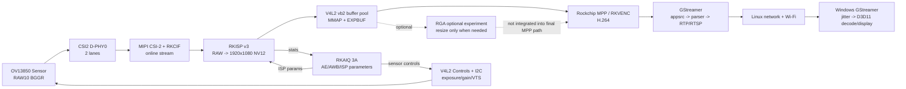

# 3. 整体架构

## 3.1 整体架构图



图中虚线 RGA 是刻意标出的边界：项目已验证 RGA 缩放，但当前最终 1080p 链路不需要缩放，因此直接绕过 RGA。

## 3.2 分层

| 层次 | 责任 | 主要代码 |
| --- | --- | --- |
| 板级描述 | 声明 I2C、clock、GPIO、MIPI endpoint 和 ISP 连接 | `rk3588s-orangepi-5-pro-camera2.dtsi`、overlay |
| Sensor 驱动 | 把 OV13850 注册成 V4L2 Subdev，控制寄存器和电源 | `ov13850_i2c_min.c` |
| Rockchip Camera BSP | D-PHY、CSI-2、CIF、RKISP、vb2 和 video node | BSP 内核驱动，项目使用而非重写 |
| 采集适配 | 打开 `/dev/video11`，建立 buffer 池和所有权循环 | `V4L2Capture` |
| 图像变换 | 对 NV12 做可选 RGA resize | `rga_nv12_resize.cpp`、`rga_v4l2_live.cpp` |
| 编码 | 把 NV12 变成 H.264/H.265 packet | `MppEncoder` |
| packet 输出抽象 | 将编码器和文件/RTP/RTSP 解耦 | `EncodedPacketSink` |
| 流媒体 | H.264 parse、RTP 打包、UDP/RTSP 服务和队列 | `GstRtpSink`、`GstRtspServerSink` |
| 画质控制 | 读 ISP stats，计算 AE/AWB，反馈 Sensor/ISP | RKAIQ bundle + 项目接入脚本 |
| 测量 | 采集每帧 timestamp 并输出 CSV/分位数 | `pipeline_stage_benchmark.cpp` |

## 3.3 为什么不做成一个大类

如果将 V4L2、RGA、MPP 和 GStreamer 都写进 `main()`，最初看起来代码更少，但会产生三个问题：

1. 失败时无法判断是 Camera、Encoder 还是 Network。
2. 很难保证 fd、mmap、MppBuffer、GObject 和 thread 的逆序释放。
3. 无法在完全相同的编码参数下对比 copy 和 DMA-BUF。

当前拆分使 `V4L2Capture` 只负责采集资源，`MppEncoder` 只负责编码资源，`EncodedPacketSink` 只定义 packet 如何交给下游。这是模块化与依赖倒置的一个小型实例。

## 3.4 `EncodedPacketSink` 为什么是关键抽象

`MppEncoder` 不应该知道 packet 最后去文件、UDP 还是 RTSP。它只调用：

```cpp
sink.consume(view);
```

因此同一个编码核心可以搭配：

- `OstreamPacketSink`：写 Annex-B 文件。
- `GstRtpSink`：送 RTP/UDP。
- `GstRtspServerSink`：服务 RTSP 客户端。
- `TimedPacketSink`：计时，可再包一层 RTP sink。

最简单的替代是在 `MppEncoder` 里直接 `ofstream.write()`。代价是每添加一种输出都要修改编码核心，也无法对 sink 耗时独立计时。

## 3.5 为什么 V4L2 和 MPP 放在同一 worker

DMA-BUF 模式下，MPP 正在读的就是当前 DQBUF 的底层内存。如果另一个线程提前 QBUF，RKISP 可能覆盖正在编码的图像。当前串行顺序是：

```text
DQBUF -> encode_put_frame -> encode_get_packet -> QBUF
```

它用较低的并行度换来简单、可证明的 buffer 所有权。代价是用户态 post-DQ 关键区包含整段阻塞式 MPP 编码。

## 3.6 为什么 RTSP 是两线程

- worker 线程：唯一访问 V4L2 和 MPP，实时顺序容易推理。
- 主线程：GLib Main Loop 处理 RTSP socket、client、media 和 bus callback。

最简单的单线程写法会在等待 V4L2 帧时阻塞 RTSP 连接事件，或者在网络事件中阻塞采集。两线程的代价是必须用 mutex/atomic 保护 appsrc、client 计数、停止状态和异常传递。

## 3.7 为什么用 DMA-BUF，但不说“全链路零拷贝”

`VIDIOC_EXPBUF` 把 V4L2 buffer 导出为 fd，`mpp_buffer_import()` 让 MPP 映射同一底层内存。它移除了 V4L2 到 MPP 之间 3.11 MB 的 CPU `memcpy`。

但仍然存在：

- RKISP DMA 写 NV12。
- MPP DMA 读 NV12 并写 H.264。
- MPP packet 复制到 GstBuffer（压缩后小数据）。
- socket 和网卡驱动的数据移动。

所以准确说法是“V4L2 到 MPP 无 CPU 整帧拷贝”。

## 3.8 如何找到功能修改点

| 需求 | 首选修改位置 |
| --- | --- |
| 新 Sensor 模式/寄存器 | `drivers/media/i2c/ov13850_i2c_min.c` |
| 修改 CAM2 lane/GPIO/clock/metadata | `rk3588s-orangepi-5-pro-camera2.dtsi` 或受控 overlay |
| 修改 ISP 输出尺寸/crop | `configure_rkisp_1080p.sh` |
| 修改 capture buffer 数、格式验证 | `v4l2_capture.hpp` |
| 修改码率、GOP、profile、H.265 | `mpp_encoder_core.hpp` + 各入口参数 |
| 新 packet 输出方式 | 实现新 `EncodedPacketSink` |
| 修改 RTP MTU/队列/丢帧策略 | `gst_rtp_sink.cpp` |
| 修改 RTSP 客户端/重连/PTS | `gst_rtsp_server.cpp`、`live_pts_clock.hpp` |
| 改画质和 3A | IQ JSON 副本、RKAIQ 兼容 patch/启动脚本；Sensor 范围问题才改驱动 |
| 新增时序指标 | `pipeline_stage_benchmark.cpp`、`FrameTiming` |
