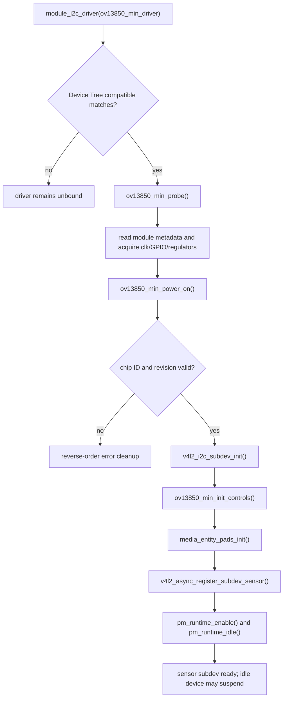
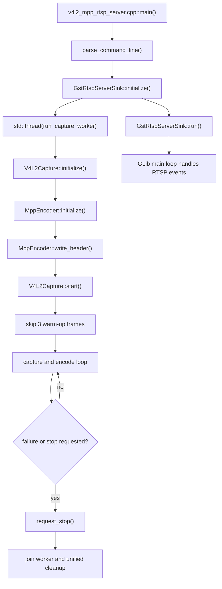
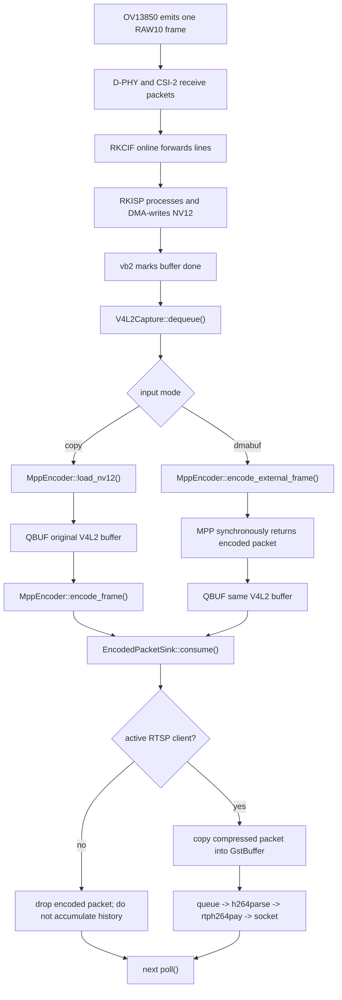
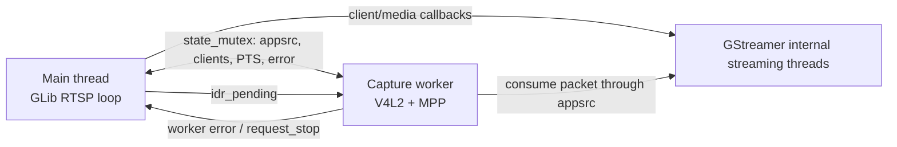

# 4. 运行时流程、调用链与资源生命周期

## 4.1 启动分为两个时期

### 内核设备启动



### 用户态 RTSP 启动



`configure_rkisp_1080p.sh` 应在用户态程序前运行。它配置 Media Graph，不是 C++ `main()` 内部的隐式步骤。

## 4.2 从 `VIDIOC_STREAMON` 到 Sensor 出图

```text
V4L2Capture::start()
-> 将 4 个 buffer 全部 VIDIOC_QBUF
-> VIDIOC_STREAMON(/dev/video11)
-> RKISP/CIF media pipeline 向上游传播 stream-on
-> ov13850_min_s_stream(sd, 1)
-> pm_runtime_get_sync()
-> ov13850_min_runtime_resume()
-> ov13850_min_power_on()
-> ov13850_min_start_streaming()
-> global register table
-> current mode register table
-> v4l2_ctrl_handler_setup()
-> 0x0100 = 1
```

这个顺序的关键是：Controls 在 mode 表之后重放，否则 mode 表会把用户设置的曝光/增益覆盖掉。

## 4.3 单帧关键路径

本项目没有自己编写的中断处理函数。Sensor/CIF/ISP/RKVENC 中断在 Rockchip BSP 驱动中；项目自研代码从 V4L2 buffer ready 后的 `poll()`/`DQBUF` 开始。因此下图是“单帧业务周期”，不是自研 ISR：



### 统一交付点

`MppEncoder::deliver_packet()` 是编码端的统一交付点：它把 MPP packet 包装成非拥有型 `EncodedPacketView`，然后调用 `sink.consume()`。所有输出前端在这里收敛。

## 4.4 最重要的调用链

### 1. 驱动匹配链

```text
DT compatible "learning,ov13850-i2c"
-> ov13850_min_of_match
-> Linux I2C core
-> ov13850_min_probe()
```

### 2. Sensor Stream 链

```text
VIDIOC_STREAMON
-> media pipeline
-> ov13850_min_s_stream(1)
-> pm_runtime_get_sync()
-> ov13850_min_start_streaming()
-> write_array(global)
-> write_array(mode)
-> v4l2_ctrl_handler_setup()
-> write_reg(0x0100, 1)
```

### 3. Control 链

```text
RKAIQ or v4l2-ctl
-> V4L2_CID_EXPOSURE / GAIN / VBLANK
-> ov13850_min_set_ctrl()
-> pm_runtime_get_if_in_use()
-> I2C write 0x3500..0x3502 / 0x350a..0x350b / 0x380e..0x380f
```

### 4. V4L2 buffer 链

```text
V4L2Capture::initialize()
-> open
-> QUERYCAP
-> G_FMT
-> REQBUFS
-> QUERYBUF
-> mmap
-> optional EXPBUF + mpp_buffer_import
```

### 5. 采集循环

```text
poll
-> VIDIOC_DQBUF
-> validate index/bytesused/timestamp
-> process frame
-> VIDIOC_QBUF
```

### 6. MPP 编码链

```text
encode_external_frame()
-> encode_buffer()
-> mpp_frame_init()
-> mpp_frame_set_buffer()
-> encode_put_frame()
-> encode_get_packet()
-> deliver_packet()
```

### 7. RTP 链

```text
GstRtpSink::consume()
-> make_gst_buffer()
-> gst_app_src_push_buffer()
-> queue
-> h264parse
-> rtph264pay
-> udpsink
```

### 8. RTSP 新客户端恢复链

```text
on_client_connected()
-> add_client()
-> header_pending = true
-> idr_pending = true
-> capture worker take_client_idr_request()
-> MppEncoder::request_idr()
-> next packet stream starts with header + IDR
```

### 9. 3A 闭环

```text
RKISP stats DMA buffer
-> rkaiq_3A_server / librkaiq
-> AE/AWB calculation
-> Sensor V4L2 controls + ISP parameter buffer
-> I2C exposure/gain/VTS + ISP AWB/CCM/Gamma
-> next frames produce new stats
```

## 4.5 控制流和数据流的区别

**数据流**搬运像素或码流：RAW10、NV12、H.264、RTP packet。

**控制流**只携带小参数：寄存器值、format、buffer index、PTS、client 状态、IDR 请求。

两者不能混淆：I2C 只发送控制字节，完整图像绝不会通过 I2C 传输。

## 4.6 多线程模型



### 共享状态

- `state_mutex_`：`media_`、`appsrc_`、`bus_`、codec header、PTS clock、active client、error 和 IDR flag。
- `clients_mutex_`：带 GObject 引用的 `clients_` vector。
- `worker_stop`、`signal_stop_requested`：跨线程停止标志。
- packet 像素数据不放入自建无界队列；GStreamer `queue` 是有界且 `leaky=downstream`。

项目没有使用 `condition_variable`、`epoll`、自建 ring buffer 或线程池。

## 4.7 资源生命周期

### Camera fd 与 MMAP buffer

```text
open
-> QUERYCAP / G_FMT
-> REQBUFS / QUERYBUF
-> mmap
-> optional EXPBUF + MppBuffer import
-> QBUF / STREAMON
-> repeated DQBUF / QBUF
-> STREAMOFF
-> mpp_buffer_put
-> close dma-buf fd
-> munmap
-> close video fd
```

### MPP

```text
mpp_create
-> mpp_init
-> mpp_enc_cfg_init / SET_CFG
-> allocate DRM buffers
-> repeated frame/packet init and deinit
-> buffer_put
-> group_put
-> cfg_deinit
-> mpi reset
-> mpp_destroy
```

### RTSP/GObject

```text
gst_init
-> GMainLoop / server / factory
-> attach server
-> client and media callbacks acquire refs
-> stop source and close clients
-> release bus/appsrc/media refs
-> unref server and main loop
```

## 4.8 退出流程

```text
SIGINT/SIGTERM or worker/GStreamer error
-> set atomic stop flag or record first error
-> g_main_loop_quit()
-> main sets worker_stop
-> worker exits loop
-> capture.stop() / STREAMOFF
-> worker request_stop()
-> main joins worker
-> rethrow worker error / check sink error
-> stack unwinds in reverse construction order
-> GstRtspServerSink cleanup
-> MppEncoder cleanup
-> V4L2Capture cleanup
-> kernel stream-off propagates to sensor
-> pm_runtime_put()
-> sensor runtime_suspend/power_off
```

必须 `join` worker 后才析构 sink，否则 worker 可能继续调用已释放的 `GstRtspServerSink`。

## 4.9 “模式到反馈角度”映射

这一电机控制类文档项在 Camera 项目中不适用。本项目对应的是“Sensor 模式到反馈统计”：

| Sensor 模式 | 图像反馈 | 控制输出 |
| --- | --- | --- |
| 2112x1568 RAW10 | RKISP AE histogram/AWB grid | exposure、analogue gain、VBLANK、ISP AWB/CCM |
| 4224x3136 RAW10 | 同类 stats，帧率更低 | 受该模式 VTS/曝光范围限制 |
