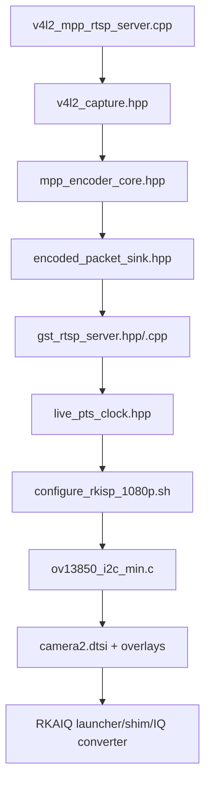

# 7. 源码地图与最佳阅读路线

## 7.1 先看“自研小项目”，不要从 Linux 顶层目录开始

`linux-orangepi` 是完整 Linux 内核树，但学习主线只集中在：

```text
drivers/media/i2c/ov13850_i2c_min.c
arch/arm64/boot/dts/rockchip/rk3588s-orangepi-5-pro-camera2.dtsi
arch/arm64/boot/dts/rockchip/overlay/rk3588-opi5pro-cam2*.dts
ov13850_opi5pro_learning/
    scripts/
    rga/
    mpp/
    streaming/
    rkaiq/
    benchmarks/
docs/codex/
```

`arch/` 和 `drivers/` 其余大量 BSP/内核文件是依赖背景，遇到具体问题再追。

## 7.2 第一遍总路线



这个顺序故意从最终业务 `main()` 开始，先知道各模块如何被使用，再钻入底层实现。

## 7.3 A 级：第一遍必看

### 1. `streaming/src/v4l2_mpp_rtsp_server.cpp`

**为什么第一个看**：这是最终产品形态的组合入口，一次性展示 Camera、MPP、RTSP 和线程如何组装。

**看之前知道**：只要知道 V4L2 产生图像，MPP 产生 H.264，RTSP 服务客户端即可。

**文件内部顺序**：

1. 顶部业务注释，建立两线程心智模型。
2. `CommandLine`，看最终业务可配置面。
3. `WorkerResult`，看线程如何返回统计和异常。
4. `main()` 213-291，先看对象构造、创建线程、`sink.run()`、join 和错误检查。
5. `run_capture_worker()` 126-209，再看完整帧循环。
6. `parse_command_line()` 和 `handle_signal()` 最后看，它们是支撑逻辑。

**看完应理解**：主线程/worker 分工、copy/dmabuf 分支、DQBUF 到 QBUF 顺序、IDR 请求如何跨线程。

### 2. `mpp/src/v4l2_capture.hpp`

**为什么现在看**：`main()` 中的 `capture.dequeue()` 是整条用户态链路的输入。

**文件内部顺序**：

1. 固定尺寸常量和 `V4L2MemoryMode`。
2. `CapturedFrame`，先确立返回数据的生命期。
3. `V4L2Capture` 成员 `fd_/streaming_/buffers_`。
4. `MappedBuffer`，区分 CPU address、dma-buf fd 和 MPP handle。
5. `initialize()`：open → format → REQBUFS → mmap → EXPBUF/import。
6. `start()`：先 QBUF 后 STREAMON。
7. `dequeue()` 和 `requeue()`：所有权循环。
8. `mpp_buffer()`：DMA-BUF 路径如何把 index 转成 MPP 输入。
9. `cleanup()`：逆序释放。

**看完应理解**：`mmap`/`EXPBUF` 不复制像素，QBUF/DQBUF 是所有权转移。

### 3. `mpp/src/mpp_encoder_core.hpp`

**前置**：已知 `CapturedFrame` 和 DMA-BUF 的含义。

**文件内部顺序**：

1. width/height/stride/frame size 常量，特别比较 1080 与 1088。
2. `Codec`、`RateControl`、`EncoderConfig`、`EncoderStats`。
3. `MppEncoder` 成员，认准 context/API/config/group/frame/packet。
4. `initialize()`，看硬件会话如何建立。
5. `write_header()`和 `request_idr()`，理解可解码起点。
6. `load_nv12()` + `copy_nv12_to_strided()`，理解 copy 对照路径。
7. `encode_frame()` / `encode_external_frame()`，看两条入口只差 buffer 来源。
8. `encode_buffer()`，看单帧提交/取包。
9. `deliver_packet()`，看与下游的边界。
10. `cleanup()`，看 MPP 资源逆序释放。

### 4. `mpp/src/encoded_packet_sink.hpp`

**为什么现在看**：已经在 `deliver_packet()` 看到它，现在可理解为什么 MPP 不依赖 GStreamer。

**顺序**：`EncodedPacketView` 字段 →非拥有生命期注释 → `EncodedPacketSink` 接口 → `OstreamPacketSink`。

### 5. `streaming/src/gst_rtsp_server.hpp/.cpp`

**前置**：知道 sink 同步收到压缩 packet，也知道 RTSP callback 在另一线程。

**内部顺序**：

1. 头文件 `RtspServerConfig`。
2. 头文件的 public API，区分 worker 会调哪些、main 会调哪些。
3. 头文件成员变量，按 GLib objects / state mutex / clients mutex / atomic stats 分组。
4. `.cpp::initialize()`，先看 RTSP factory 的 Pipeline 字符串。
5. `run()` / `request_stop()`，理解主循环。
6. `add_client()` / `remove_client()`，理解 header + IDR 和 client ref。
7. `configure_media()` / `clear_media()`，理解 appsrc 为什么不是始终存在。
8. `consume()`，看锁内拿引用/状态、锁外 push。
9. `record_error()` 和 bus callback，看异常如何唤醒 main。
10. `cleanup()`，看关闭 callback 与 GObject 引用的顺序。

### 6. `streaming/src/live_pts_clock.hpp`

先看顶部的 30.05/30.00 fps 问题注释，再看 `map()` 三个状态量，最后看 `reset()` 为什么在新 media 时调用。

### 7. `scripts/configure_rkisp_1080p.sh`

**为什么现在看**：你已经知道 C++ 要求什么格式，现在看这个前置如何被建立。

**顺序**：顶部 RAW/crop/output 常量 → `find_unique_node()` 动态定位 → `set_subdev_raw_format()` → `main()` 的 Sensor/DPHY/CSI/CIF 顺序 → mainpath format/crop → `validate_readback()`。

### 8. `drivers/media/i2c/ov13850_i2c_min.c`

**为什么不是第一个看**：这个文件超过 2300 行且包含大量寄存器表。先知道上层怎样使用 Sensor，才不会陷入寄存器数字。

**内部顺序**：

1. 顶部业务注释和寄存器常量。
2. `ov13850_mode` 和 `ov13850_min`，先建立数据模型。
3. 暂时跳过 global/mode 寄存器表的每个值，只认标记和两个 mode 定义。
4. `read_reg/write_reg/write_array`，理解 I2C 层。
5. `power_on/power_off` 和 Runtime PM callback。
6. `start_streaming/stop_streaming/s_stream`，理解真正出图交易。
7. `init_controls/set_ctrl`，理解 API 值到寄存器值的映射。
8. `enum_* / get_fmt / set_fmt / get_mbus_config`，理解能力协商。
9. `ioctl()`，看 RKAIQ module-info。
10. `probe()`，把之前的所有子系统组起来。
11. `remove()`、match table、`i2c_driver`，看入口/退出。
12. sysfs 调试接口最后看；寄存器表只在调一个具体模式时再逐项核对。

### 9. `rk3588s-orangepi-5-pro-camera2.dtsi` 与 overlays

**顺序**：`ov13850_2` 节点的 reg/clock/GPIO/module metadata → Sensor endpoint → `csi2_dcphy0` input/output → `mipi0_csi2` input/output → `rkcif_mipi_lvds` → `sditf` → `rkisp1_vir0`。最后看 `rk3588-opi5pro-cam2.dts` 如何将这些 disabled 节点打开，学习 overlay 如何只替换 compatible。

### 10. RKAIQ 接入

**文件顺序**：

1. `rkmodule_info_probe.c`：先知道 RKAIQ 需要什么元数据。
2. 驱动 `ov13850_min_ioctl()`：看正式数据从哪里来。
3. `rkmodule_info_preload.c`：理解旧内核临时 shim 的边界。
4. `prepare_compatible_iq.sh`：看 IQ JSON 为什么要转换，特别是 fixed AF。
5. `run_rkaiq_local.sh`：看私有库/IQ/shim 如何组合。
6. `patches/0001-...patch`：了解对上游 RKAIQ 的最小兼容改动，不需第一遍追全部上游源码。

## 7.4 B 级：掌握主线后看

### `mpp/src/nv12_mpp_encoder.cpp`

阅读顺序：文件入口业务注释 → `CommandLine` → `read_input()` → `main()` 中的 header/frame/EOS。它用于把 Camera 问题从 MPP 问题中隔离。

### `mpp/src/v4l2_mpp_encoder.cpp`

阅读顺序：顶部 copy/dmabuf 图 → `ver_stride` 分支 →对象构造顺序 → warmup →单帧 DQ/copy-or-import/encode/Q →统计。它是理解主链 DMA-BUF 所有权的最简单程序。

### `streaming/src/v4l2_mpp_rtp_sender.cpp`

阅读顺序：`CommandLine` → `main()` 对象构造 → header/STREAMON/warmup →帧循环 → queue overrun 到 IDR → EOS/统计。它是单线程、有限帧数的网络对照程序。

### `streaming/src/gst_rtp_sink.hpp/.cpp`

先看 `RtpSinkConfig`、成员和 `initialize()` Pipeline，再看 `make_gst_buffer()` 的 packet copy/PTS，最后看 bus error、overrun callback 和 cleanup。

### `rga/src/rga_nv12_resize.cpp`

顺序：顶部隔离实验图 →尺寸/格式常量 → `ImportedBuffer` →文件读写 → `resize_once()` → `main()` 的 import/wrap/imcheck/warmup/benchmark。

### `rga/src/rga_v4l2_live.cpp`

顺序：`InputMode` → `CapturedFrame`/`MappedBuffer` → `VideoCapture` → `ImportedBuffer` → `CopyRgaResizer` → `DirectRgaResizer` → `main()` 两个分支的 QBUF 时机 → CPU/RGA 统计。

### `benchmarks/src/pipeline_stage_benchmark.cpp`

顺序：`FrameTiming` 指标边界 → `process_frame()` 打点顺序 → `TimedPacketSink` → `write_csv()` → `print_series()` → `main()` 的 init/warmup/sample/cleanup。

## 7.5 C 级：遇到问题或要修改时看

- `rkaiq/patches/*.patch`：要调 RKAIQ 兼容时再读。
- `scripts/package_*`、`fetch_build_*`：要升级上游版本或重建 bundle 时读。
- `benchmarks/scripts/*`：要重新量化时读。
- PowerShell receiver scripts：要调 Windows GStreamer 解码/jitter 时读。
- sysfs 调试函数：要查 Sensor 寄存器时读。
- Rockchip CIF/ISP/vb2 平台驱动：只有用户态和 Sensor 层都正确后，再追内核 BSP。

## 7.6 D 级：第一遍可忽略

- `rga/third_party/librga/include/` 和二进制库：上游 API，查接口时才看。
- MPP/RKAIQ 忽略的 `build/` 上游源码树。
- `release/`、`staging/`、`.dtbo/.dtb`、`.tar.gz`：产物不是主逻辑。
- 测试脚本的每个 grep/sha256 细节：先知道它验收什么。
- 完整 Linux `fs/`、`net/`、`mm/` 等通用内核实现。

## 7.7 程序入口清单

| 入口 | 用途 |
| --- | --- |
| `nv12_mpp_encoder.cpp::main()` | 单帧文件重复编码，隔离 MPP |
| `v4l2_mpp_encoder.cpp::main()` | 实时 V4L2 到 MPP，输出文件 |
| `v4l2_mpp_rtp_sender.cpp::main()` | 有限帧 RTP/UDP 测试 |
| `v4l2_mpp_rtsp_server.cpp::main()` | 最终 shared RTSP 服务 |
| `rga_nv12_resize.cpp::main()` | 文件式 RGA resize |
| `rga_v4l2_live.cpp::main()` | 实时 RGA copy/direct 对比 |
| `pipeline_stage_benchmark.cpp::main()` | 分阶段时序采样 |
| `rkmodule_info_probe.c::main()` | module-info ioctl 独立验证 |
| `module_i2c_driver(ov13850_min_driver)` | Sensor 内核模块入口 |

## 7.8 第一遍阅读的停止条件

当你能不看文档回答下列问题，第一遍就足够了：

1. 哪个 `main()` 是最终 RTSP 业务入口？
2. 为什么 QBUF 时机在 copy 和 DMA-BUF 模式不同？
3. `MppEncoder` 为什么不直接依赖 GStreamer？
4. 新 RTSP 客户端为什么需要 SPS/PPS + IDR？
5. 30.05 fps 和 30.00 fps 为什么会造成长时间延迟累积？
6. Sensor 数据经过哪些硬件到 `/dev/video11`？
7. AE 计算的输入是什么，输出又是什么？
8. 当前 RGA 为什么不在最终 1080p 主链上？

## 7.9 分阶段学习路线

### 阶段 1：只理解项目要完成什么

**读**：`README.md`、`01_overview.md`、`03_architecture.md`。
**重点**：能画出 RAW10 到 PC 屏幕主链，能说清 RGA 是可选项。
**暂时忽略**：寄存器表、GObject ref、MPP 配置键。

### 阶段 2：理解最终 `main()` 和组装关系

**读**：`v4l2_mpp_rtsp_server.cpp`。
**重点**：参数解析、对象构造顺序、worker/main 线程分工、停止协议。
**验收**：能从 `main()` 口述到稳态采集循环。

### 阶段 3：理解 Buffer 所有权

**读**：`v4l2_capture.hpp`、`v4l2_mpp_encoder.cpp`。
**重点**：REQBUFS/QUERYBUF/mmap/QBUF/DQBUF/EXPBUF，copy 和 DMA-BUF 的 QBUF 时机。
**验收**：能解释“为什么过早 QBUF 会花屏”。

### 阶段 4：理解 MPP 和 packet 输出抽象

**读**：`mpp_encoder_core.hpp`、`encoded_packet_sink.hpp`、`nv12_mpp_encoder.cpp`。
**重点**：MPP context/config/frame/packet，stride，SPS/PPS，IDR，sink 解耦。
**暂时忽略**：每个 QP/profile 调优细节。

### 阶段 5：理解网络和多线程

**读**：`gst_rtp_sink.cpp`、`gst_rtsp_server.hpp/.cpp`、`live_pts_clock.hpp`。
**重点**：appsrc、有界 leaky queue、RTP 分包、shared RTSP、header/IDR 恢复、mutex/atomic、PTS 漂移。
**验收**：能说清旧版 40-60 秒后延迟积累的真正原因。

### 阶段 6：追回内核 Sensor 和 Media Graph

**读**：`configure_rkisp_1080p.sh`、Camera2 DTSI/overlay、`ov13850_i2c_min.c`。
**重点**：DT compatible 到 probe，power/PM/stream/control/format，endpoint 链接。
**验收**：能口述 `VIDIOC_STREAMON` 最终如何导致 Sensor `0x0100=1`。

### 阶段 7：画质闭环与性能证据

**读**：RKAIQ probe/shim/IQ converter/launcher、`pipeline_stage_benchmark.cpp`、`10_timing.md`。
**重点**：stats 输入、AE/AWB 输出、IQ 匹配、测量边界和不能外推的数据。
**验收**：能分清 60 ms 暗场帧周期和 CPU 3A 算法耗时的区别。

## 7.10 动手修改练习

### Level 1：扩展运行时统计

在 `v4l2_mpp_rtsp_server.cpp::WorkerResult` 中增加采集 sequence 的起止值，退出时打印。
**验证点**：理解 worker 是数据的唯一写者，main 在 join 后读取无数据竞争。

### Level 2：将默认码率从 8 Mbps 改成可见的配置常量

把 RTP/RTSP 两个 `CommandLine` 的重复默认值收敛到共享常量，不改 MPP 默认行为。
**验证点**：理解 CLI 默认值与 `EncoderConfig` 之间的转换。

### Level 3：增加每 300 帧一次的滑动 FPS

在 worker 中用 `steady_clock` 输出区间 FPS，不在每帧打日志。
**验证点**：避免 I/O 扰动实时循环，并正确区分区间 FPS 和累计 FPS。

### Level 4：为 RTP sender 增加 `--codec h264|h265` 但先只允许 H.264 网络端

先完成参数解析与显式错误，不立即改 GStreamer payloader。
**验证点**：理解“MPP 支持”不等于“整条下游支持”。

### Level 5：为 `V4L2Capture` 增加格式错误的 FourCC 可读打印

将整数 FourCC 转成 4 字符输出。
**验证点**：理解 V4L2 pixel format 与 media-bus RAW code 是两个层次。

### Level 6：增加 Sensor 模式选择的单元测试

将“距离最近模式”逻辑抽出为可测试 helper，覆盖 2112x1568、4224x3136 和中间尺寸。
**验证点**：理解 TRY/ACTIVE 与离散 Sensor mode。

### Level 7：实现 RTSP H.265 分支

需要联动 MPP codec、`video/x-h265` caps、`h265parse`、`rtph265pay`、codec header 与 Windows receiver。
**验证点**：完整理解编码格式如何穿过所有模块，并用解码帧数作验收。

### Level 8：实现 RGA destination DMA-BUF 到 MPP

分配一组可被 RGA 写、MPP 读的 DMA-BUF，建立 buffer state/fence，将 `std::vector output_` 替换为真正的共享 buffer 池。
**验证点**：不得只看 API 返回 0；要检查无 CPU 整帧 copy、编码解码画面正确、buffer 不被提前复用、PM/fault 无回归。

### Level 9：将固定 1080p 合同改为多分辨率配置对象

让 capture、MPP、GStreamer caps 和 frame size 都从一个经验证的 `VideoFormat` 传递。
**验证点**：处理 width/height/stride/sizeimage 之间的区别，并保持错误信息和验收矩阵。
